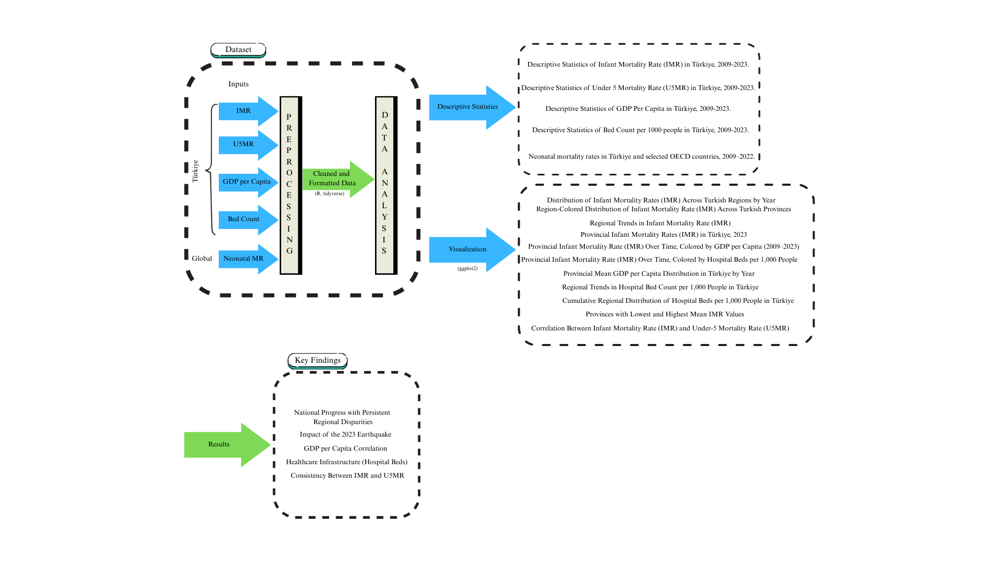

# Unequal Beginnings: Spatial Inequality and Structural Determinants of Infant Mortality in Türkiye



## Overview

This project investigates the structural and spatial determinants of infant and under-5 mortality across all **81 Turkish provinces** over a **15-year period (2009–2023)**. Using province-level panel data from TUIK and WHO, the analysis examines how GDP per capita, hospital infrastructure, and regional geography relate to child mortality outcomes.

The full paper is available in [`paper/Unequal_Beginnings_Saritas.pdf`](paper/Unequal_Beginnings_Saritas.pdf).

---

## Key Findings

- **Persistent East–West divide:** Provinces in Southeast and Eastern Anatolia consistently exhibit IMR 1.5 to 1.8 times higher than the national rate, even as national rates declined overall.
- **GDP–mortality correlation:** Strong negative relationship between provincial GDP per capita and IMR (log-linear fit); economic development is negatively associated with IMR across provinces, though not the sole determinant.
- **Hospital bed density:** Logarithmic relationship with IMR across provinces.
- **National decline:** Turkey's neonatal mortality rate declined substantially across the period, though convergence between regions remains incomplete.
- **2023 earthquake impact:** Affected provinces saw dramatic spikes — Adıyaman (23.0), Hatay (20.3), and Kahramanmaraş (20.8) per 1,000 live births — against a national average of 10.8, underscoring infrastructure vulnerability as a mortality risk factor.
- **International context:** Turkey's neonatal mortality rate remains above Western European comparators (Germany, France, Sweden, Norway) despite significant progress.

---

## Data Sources

| Variable | Source | Coverage | Unit |
|---|---|---|---|
| Infant Mortality Rate (IMR) | TUIK (Turkish Statistical Institute) | 81 provinces, 2009–2023 | per 1,000 live births |
| Under-5 Mortality Rate (U5MR) | TUIK | 81 provinces, 2009–2023 | per 1,000 live births |
| GDP per Capita | TUIK | 81 provinces, 2009–2023 | USD (×1,000) |
| Hospital Beds | TUIK | 81 provinces, 2009–2023 | per 1,000 people |
| Neonatal Mortality (international) | WHO Global Health Observatory | 8 countries, 2009–2022 | per 1,000 live births |

> **Note on WHO data:** The file `A4C49D3_ALL_LATEST.csv` must be downloaded from the [WHO Global Health Observatory](https://www.who.int/data/gho) and placed in the `data/` directory before running the WHO comparison section of the script.

---

## Methodology

1. **Data wrangling** — Raw TUIK exports arrive in a pipe-delimited proprietary format with mixed metadata rows. The script parses, cleans, and pivots each dataset into tidy long format with consistent `year` and `province` keys.

2. **Descriptive statistics** — Per-year summaries for each indicator including min, Q1, mean, median, Q3, max, standard deviation, skewness, and excess kurtosis across all 81 provinces.

3. **Correlation analysis** — Pearson correlation and scatter plots with linear/log-linear fits for GDP–IMR, GDP–U5MR, and bed count–IMR pairs.

4. **Regional aggregation** — All 81 provinces mapped to 7 NUTS-1 regions (Marmara, Aegean, Mediterranean, Central Anatolia, Black Sea, Eastern Anatolia, Southeast Anatolia); regional means plotted over time.

5. **International benchmarking** — WHO neonatal mortality data used to compare Turkey's trajectory against selected European countries.

---

## Repository Structure

```
infant-mortality-turkey/
├── analysis.R                    # Main analysis script
├── data/
│   ├── tuik_imr.xls              # TUIK infant mortality rate by province
│   ├── tuik_i5mr_raw.csv         # TUIK under-5 mortality rate (raw)
│   ├── tuik_i5mr_raw.xls         # TUIK under-5 mortality rate (Excel)
│   ├── gpd_per_capita_province.xls  # TUIK GDP per capita by province
│   ├── bed_count_100k.xls        # TUIK hospital beds per 100k population
│   └── A4C49D3_ALL_LATEST.csv    # WHO neonatal mortality (download separately)
├── outputs/
│   ├── graphAbstract.png         # Visual abstract
│   └── tables.pdf                # Summary statistics tables
└── paper/
    └── Unequal_Beginnings_Saritas.pdf   # Full paper
```

---

## Reproducing the Analysis

**Requirements:** R (≥ 4.1)

**Install dependencies:**

```r
install.packages(c(
  "dplyr", "ggplot2", "tidyverse", "readxl",
  "reshape2", "forcats", "skimr", "moments",
  "knitr", "kableExtra", "ggridges", "patchwork", "scales"
))
```

**Set working directory and run:**

```r
setwd("path/to/infant-mortality-turkey")
source("analysis.R")
```

---

## Technical Stack

- **Language:** R
- **Core libraries:** `ggplot2`, `dplyr`, `tidyverse`, `readxl`, `ggridges`, `patchwork`
- **Statistics:** `moments` (skewness/kurtosis), `skimr`, base R `cor()`
- **Output:** `knitr` + `kableExtra` for LaTeX tables
